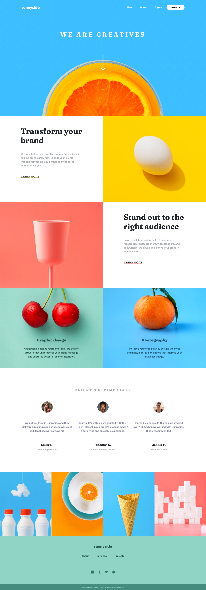

# Frontend Mentor - Sunnyside agency landing page solution

This is a solution to the [Sunnyside agency landing page challenge on Frontend Mentor](https://www.frontendmentor.io/challenges/sunnyside-agency-landing-page-7yVs3B6ef). Frontend Mentor challenges help you improve your coding skills by building realistic projects.

## Table of contents

  - [Overview](#overview)
  - [The challenge](#the-challenge)
  - [Screenshot](#screenshot)
  - [Links](#links)
  - [My process](#my-process)
  - [Built with](#built-with)
  - [What I learned](#what-i-learned)
  - [Continued development](#continued-development)
  - [Useful resources](#useful-resources)
  - [Author](#author)

## Overview

### The challenge

Users should be able to:

- View the optimal layout for the site depending on their device's screen size
- See hover states for all interactive elements on the page

### Screenshot



### Links

- Solution URL: [Add solution URL here](https://your-solution-url.com)
- Live Site URL: [Add live site URL here](https://your-live-site-url.com)

## My process

### Built with

- Semantic HTML5 markup
- CSS custom properties
- Flexbox
- CSS Grid
- Desktop-first workflow
- [Bootstrap-v4.0](https://getbootstrap.com/docs/4.0) - CSS Framework

### What I learned

- Comparatively easier site for me to build, somehow need to speed up my workflow!
- The "no-gutters" class when added along with <strong>.row</strong> class, removes the negative margins of the <strong>.row</strong> class.

```html
<h1>Code snippet</h1>
  <div class="row no-gutters"></div>
```

### Continued development

- Require a better understanding of .container-fluid Vs .container Bootstrap classes.

### Useful resources

- [Example resource 1](https://stackoverflow.com/a/56655968) - This helped me handle the problem of container overflow.

## Author

- Frontend Mentor - [@agatha-sb](https://www.frontendmentor.io/profile/agatha-sb)
- Twitter - [@agatha_sb](https://www.twitter.com/agatha_sb)

